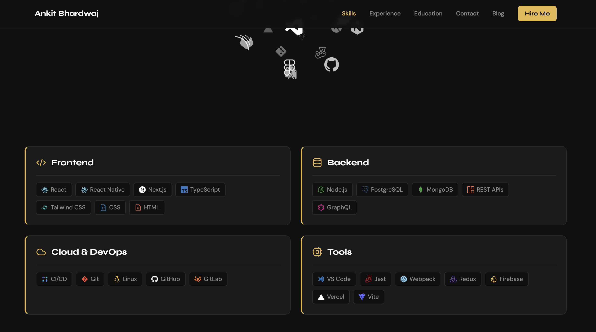
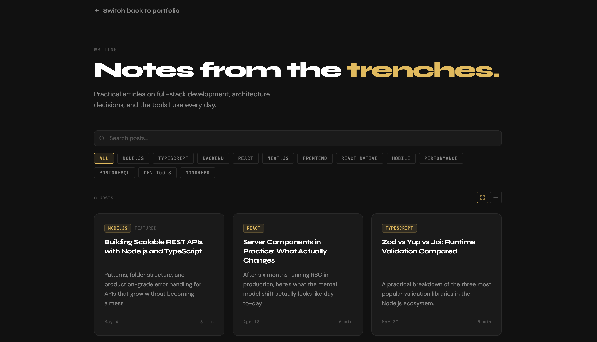

# Portfolio — Ankit Bhardwaj

A single-page personal portfolio built with React 18, Vite 6, and Tailwind CSS. Showcases skills, experience, education, and projects, with an integrated MDX-powered blog.

🔗 **Live site:** [bhardwajankit.com](https://bhardwajankit.com)

---

## Screenshots

**Hero**


**Skills**



**Blog**



---

## Tech Stack

| Layer | Tools |
|---|---|
| Framework | React 18, Vite 6 |
| Routing | React Router v7, react-router-hash-link |
| Styling | Tailwind CSS v3, shadcn/ui (Radix primitives) |
| Animation | Framer Motion v11 |
| Content | MDX (`@mdx-js/rollup`, `@mdx-js/react`) for the blog |
| Syntax highlighting | Prism.js |
| Icons | react-icons, lucide-react |
| Forms | Web3Forms (client-side, no backend) |
| Deployment | Vercel |

---

## Sections

The site is a single scrollable page with anchor-link navigation, plus a separate blog route.

- `#home` — Hero with intro and a live syntax-highlighted code window
- `#skills` — Categorized skill grid with icon cloud
- `#experience` — Work history
- `#education` — Academic background
- `#contact` — Web3Forms-powered contact form
- `/blog` — MDX-rendered articles

---

## Project Structure

```
portfolio/
├── docs/
│   └── superpowers/           # Design spec & implementation plan
├── public/
├── src/
│   ├── App.jsx                # Routes: /, /blog, /blog/:slug
│   ├── main.jsx
│   ├── assets/
│   │   ├── css/index.css      # Design tokens, fonts, Prism theme
│   │   └── images/
│   ├── blog/
│   │   ├── BlogIndex.jsx
│   │   ├── BlogPost.jsx
│   │   ├── Callout.jsx
│   │   ├── posts.js
│   │   └── content/           # MDX articles
│   ├── components/            # One file per page section
│   │   ├── Header.jsx
│   │   ├── Hero.jsx
│   │   ├── PortfolioPage.jsx  # About — rendered inside Hero
│   │   ├── Skills.jsx
│   │   ├── Experience.jsx
│   │   ├── Education.jsx
│   │   ├── Projects.jsx
│   │   ├── Contact.jsx
│   │   ├── globe.jsx
│   │   └── ui/                # shadcn/ui primitives
│   ├── constants/index.js     # Email, location, pincode
│   └── lib/utils.js           # cn() — Tailwind class merger
├── tailwind.config.js
├── vite.config.js
└── vercel.json
```

---

## Design System

Defined in [src/assets/css/index.css](src/assets/css/index.css):

- Background `#111111` · Surface `#1A1A1A` · Border `#2A2A2A`
- Gold accent `#E8B84B` · Secondary text `#888888`
- Headings: `font-syne font-bold text-4xl lg:text-5xl`
- Section numbering: `01 — About Me`, `02 — Skills`, …

---

## Getting Started

**Prerequisites:** Node.js 18+ and Git.

```bash
git clone https://github.com/blacktornado2/portfolio.git
cd portfolio
npm install
npm run dev
```

Open [http://localhost:5173](http://localhost:5173) in your browser.

### Scripts

| Command | Description |
|---|---|
| `npm run dev` | Start the Vite dev server |
| `npm run build` | Build for production into `dist/` |
| `npm run preview` | Preview the production build locally |
| `npm run lint` | Run ESLint |

---

## Customization

- **Personal info** (email, location, pincode) — edit [src/constants/index.js](src/constants/index.js)
- **GitHub & LinkedIn URLs, Web3Forms key** — edit [src/components/Contact.jsx](src/components/Contact.jsx)
- **Skills, experience, education** — edit data arrays at the top of each section component
- **Blog posts** — add an `.mdx` file to [src/blog/content/](src/blog/content/) and register it in [src/blog/posts.js](src/blog/posts.js)

---

## Contributing

1. Fork the repo
2. Create a feature branch: `git checkout -b feature/your-feature`
3. Commit your changes: `git commit -m 'Add your feature'`
4. Push: `git push origin feature/your-feature`
5. Open a Pull Request

---

<div align="center">Made with ❤️ by <a href="https://github.com/blacktornado2">Ankit Bhardwaj</a></div>
