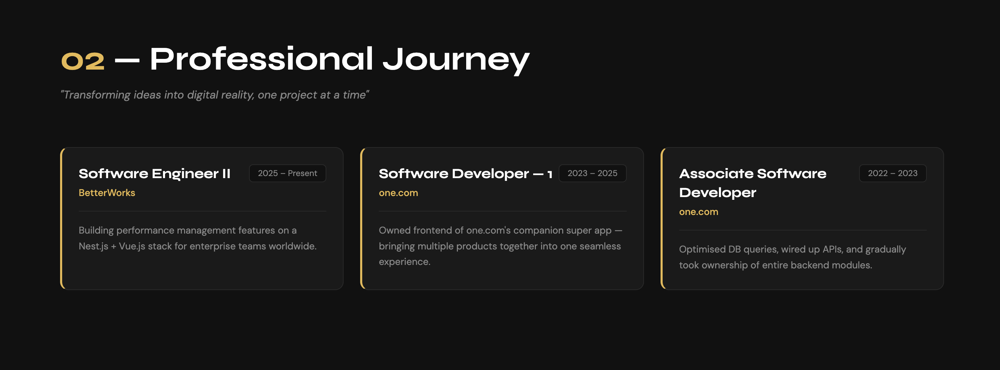
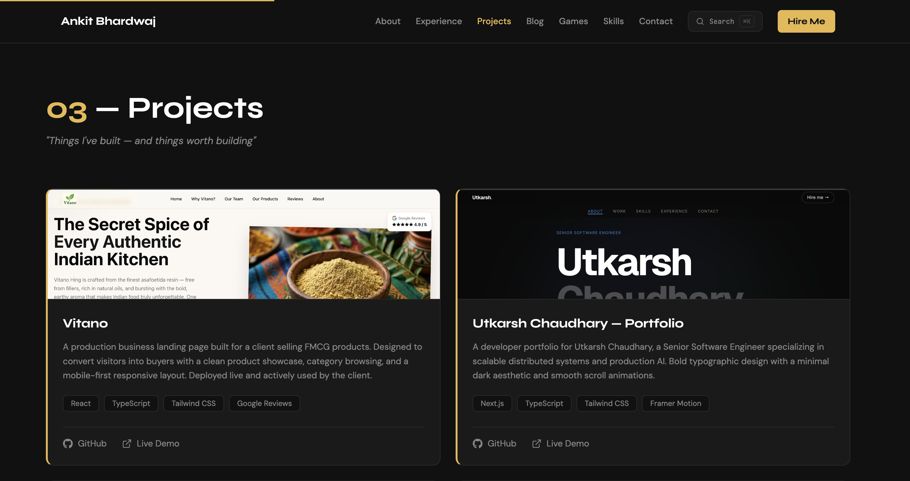
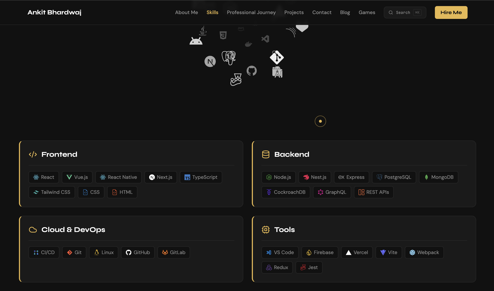
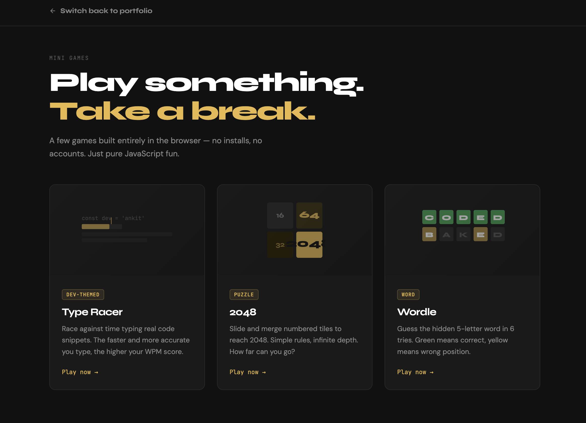
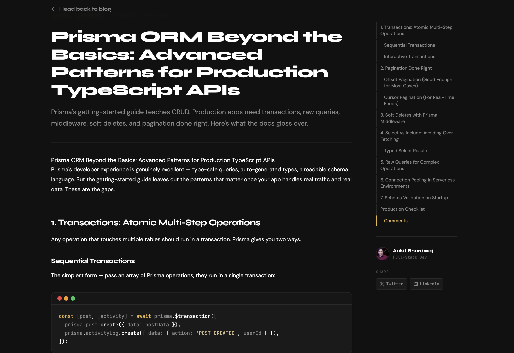
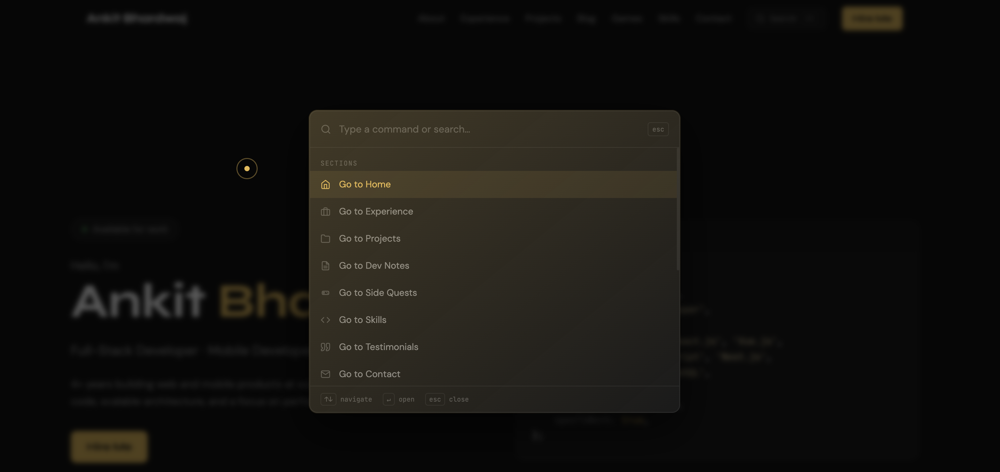
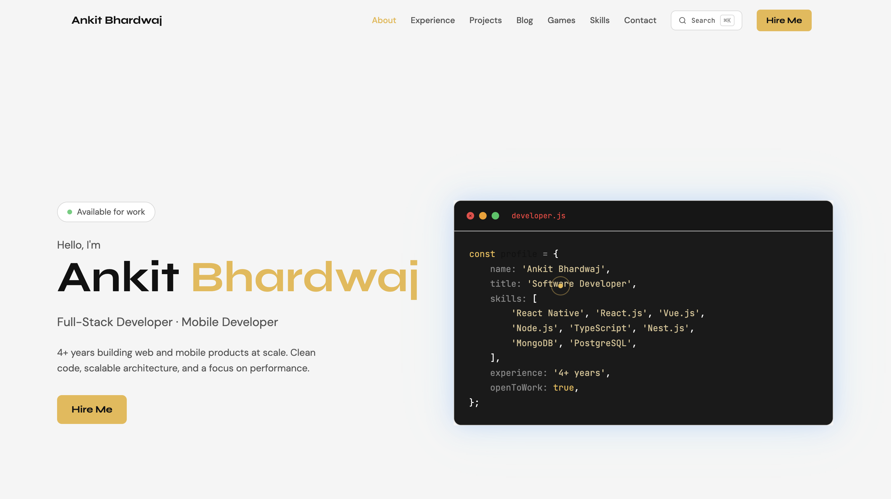

# Portfolio — Ankit Bhardwaj

A personal portfolio and blog built as an npm-workspaces monorepo: **React 18 + Vite 6** on the frontend, **NestJS 10 + Prisma** on the backend. The portfolio is a single scrollable page with anchor navigation; the blog, games, and draw tool are separate routes backed by the API.

🔗 **Live site:** [bhardwajankit.com](https://bhardwajankit.com)

---

## Screenshots

**Hero**


| Experience | Projects |
|:---:|:---:|
|  |  |
| **Skills** | **Side Quests** |
|  |  |
| **Blog index** | **Blog post** |
|  |  |
| **Command palette (⌘K)** | **Light mode** |
|  |  |

---

## Tech Stack

### Frontend (`client/`)

| Layer | Tools |
|---|---|
| Framework | React 18, Vite 6 (ESM, `@` alias → `client/src/`) |
| Routing | React Router v7, react-router-hash-link |
| Styling | Tailwind CSS v3, shadcn/ui (Radix primitives) |
| Theming | CSS custom properties — dark/light mode + switchable gold/blue/purple accent |
| Animation | Framer Motion v11 |
| Syntax highlighting | Prism.js |
| Icons | react-icons, lucide-react |
| Blog rendering | react-markdown, remark-gfm |
| Forms | Web3Forms (client-side, no backend required) |
| Testing | Vitest (draw tooling) |
| Deployment | Vercel |

### Backend (`server/`)

| Layer | Tools |
|---|---|
| Framework | NestJS v10 — modules: `posts`, `comments`, `likes`, `auth` |
| ORM | Prisma 6 |
| Database | PostgreSQL (Neon, serverless) |
| Auth | JWT (passport-jwt), bcrypt password hashing |
| Language | TypeScript |
| Deployment | Render (Docker) |

---

## Sections & Routes

| Route | Description |
|---|---|
| `/` `#home` | 01 — Hero: intro, availability badge, syntax-highlighted code window (About lives inside Hero) |
| `/` `#experience` | 02 — Professional Journey: experience cards |
| `/` `#projects` | 03 — Projects: project cards with preview images |
| `/` `#blog` | 04 — Dev Notes: 3 latest posts from the API, CTA to /blog |
| `/` `#games` | 05 — Side Quests: 3 game cards (2048, Wordle, TypeRacer) |
| `/` `#skills` | 06 — Skills: icon cloud + skill category cards |
| `/` `#testimonials` | 07 — Testimonials: infinite marquee (not in navbar) |
| `/` `#contact` | 08 — Contact: info panel + Web3Forms contact form |
| `/blog` | Blog index — search, tag filters, grid/list toggle |
| `/blog/:slug` | Individual blog post — react-markdown, comments, likes |
| `/games` | Games hub |
| `/games/2048` | 2048 |
| `/games/wordle` | Wordle |
| `/games/typeracer` | TypeRacer |
| `/draw` | Canvas drawing tool |

---

## API Endpoints

| Method | Path | Auth | Description |
|---|---|---|---|
| `GET` | `/posts` | — | Paginated, optional `?tag=` filter |
| `GET` | `/posts/:slug` | — | Single post |
| `POST` `PUT` `DELETE` | `/posts` `/posts/:slug` | JWT | Create / update / delete post |
| `GET` `POST` | `/posts/:slug/comments` | — | List / add comments |
| `DELETE` | `/comments/:id` | JWT | Delete comment |
| `GET` `POST` | `/posts/:slug/likes` | — | Like count / toggle like (IP-hash based) |
| `POST` | `/auth/login` | — | Returns `accessToken` JWT |

---

## Projects

| Project | Stack | Links |
|---|---|---|
| [Vitano](https://www.vitano.in) | React, TypeScript, Tailwind CSS | [GitHub](https://github.com/blacktornado2/vitano) · [Live](https://www.vitano.in) |
| DevTrack | React, TypeScript, Node.js, PostgreSQL, Socket.io | — |
| ShopFlow | React Native, Node.js, MongoDB, Stripe, Firebase | — |

Project cards support an optional `image` field — set it to an imported asset to show a preview thumbnail at the top of the card.

---

## Project Structure

```
portfolio/                          # npm-workspaces monorepo root
├── client/                         # React frontend
│   ├── src/
│   │   ├── App.jsx                 # All routes
│   │   ├── main.jsx
│   │   ├── assets/
│   │   │   ├── css/index.css       # Design tokens (CSS vars), fonts, Prism theme
│   │   │   └── images/
│   │   ├── blog/                   # BlogIndex, BlogPost, markdown content
│   │   ├── components/
│   │   │   ├── Header.jsx          # Fixed nav + scroll progress bar (⌘K palette)
│   │   │   ├── Hero.jsx            # 01 — Hero + availability badge (About rendered here)
│   │   │   ├── Experience.jsx      # 02 — Professional Journey
│   │   │   ├── Projects.jsx        # 03 — Projects
│   │   │   ├── FieldNotesSection.jsx  # 04 — Dev Notes (fetches API)
│   │   │   ├── SideQuestsSection.jsx  # 05 — Side Quests (static)
│   │   │   ├── Skills.jsx          # 06 — Skills
│   │   │   ├── TestimonialsSection.jsx  # 07 — Testimonials (marquee)
│   │   │   ├── Contact.jsx         # 08 — Contact
│   │   │   ├── Footer.jsx          # Global footer + ThemeSwitcher + ModeToggle
│   │   │   ├── CommandPalette.jsx  # ⌘K search
│   │   │   └── ui/                 # shadcn/ui primitives — read-only
│   │   ├── games/                  # GamesIndex + 2048 / Wordle / Typeracer
│   │   ├── draw/                   # Canvas draw tool + Vitest specs
│   │   ├── constants/index.js      # Email, location, pincode, GitHub URL, LinkedIn URL
│   │   └── lib/
│   │       ├── api.ts              # API client (reads VITE_API_URL, injects JWT)
│   │       └── ThemeContext.jsx    # Accent colour + dark/light mode context
│   ├── tailwind.config.js
│   └── vite.config.js
├── server/                         # NestJS backend
│   ├── src/                        # auth / posts / comments / likes modules
│   ├── prisma/                     # schema, migrations, seed
│   └── tsconfig.json
├── packages/                       # Shared workspace packages
├── docs/
│   ├── design-system.md            # Full "Dark Refined" design system
│   └── superpowers/                # Historical design specs & plans
├── package.json                    # Root scripts (run both halves via concurrently)
└── vercel.json
```

---

## Design System ("Dark Refined")

Tokens are defined as CSS custom properties in `client/src/assets/css/index.css`. Full reference in [docs/design-system.md](docs/design-system.md).

- All background/surface/border/text values use CSS vars (`var(--bg)`, `var(--surface)`, `var(--border)`, `var(--text-1..4)`) — supports **dark (default) and light mode** via `[data-mode="light"]` on `<html>`
- Gold accent `var(--accent)` (`#E8B84B` default) — switchable to blue or purple via the ThemeSwitcher in the footer
- Headings: `font-syne font-bold text-4xl lg:text-5xl`
- Section numbering: `01 — About Me` … `08 — Contact` (gold number, em-dash, `var(--text-1)` name)

---

## Getting Started

**Prerequisites:** Node.js 18+, Git, and a PostgreSQL connection string (e.g. a free [Neon](https://neon.tech) database) for the backend.

```bash
git clone https://github.com/blacktornado2/portfolio.git
cd portfolio
npm install            # installs all workspaces
```

Copy `.env.example` to `server/.env` and fill in the values (see [Environment Variables](#environment-variables)).

### Run both halves (from the repo root)

```bash
npm run dev            # client (Vite :5173) + server (Nest :3001) via concurrently
```

### Server setup (first run)

```bash
cd server
npx prisma generate
npm run prisma:migrate # apply migrations
npm run prisma:seed    # seed the database (admin user + sample posts)
```

### Root Scripts

| Command | Description |
|---|---|
| `npm run dev` | Start client + server together |
| `npm run build` | Build all workspaces |
| `npm run lint` | Lint all workspaces |

### Server Scripts (`cd server`)

| Command | Description |
|---|---|
| `npm run start:dev` | ts-node dev server (`:3001`) |
| `npm run prisma:migrate` | Apply migrations (dev) |
| `npm run prisma:seed` | Seed the database |
| `npx prisma migrate deploy` | Apply migrations (production) |

---

## Environment Variables

**Server** (`server/.env`):

| Variable | Description |
|---|---|
| `DATABASE_URL` | PostgreSQL connection string (append `?sslmode=require` for Neon) |
| `JWT_SECRET` | Secret used to sign JWTs |
| `ADMIN_USERNAME` | Admin login username |
| `ADMIN_PASSWORD_HASH` | bcrypt hash of the admin password |
| `CLIENT_URL` | Comma-separated allowed CORS origins (include both `www.` and non-`www.`) |
| `PORT` | Server port (defaults to `3001`) |

**Client:**

| Variable | Description |
|---|---|
| `VITE_API_URL` | Base URL of the backend API |

See `.env.example` at the repo root for the full template.

---

## Deployment

| Layer | Host | Notes |
|---|---|---|
| Client | **Vercel** | Set `VITE_API_URL` to the Render API URL; redeploy after changing env vars |
| Server | **Render** (free tier) | Docker deploy from `server/Dockerfile`; cold starts after 15 min idle |
| Database | **Neon** | Serverless Postgres; `DATABASE_URL` with `?sslmode=require` |

---

## Customization

- **Personal info** (email, location, pincode, GitHub URL, LinkedIn URL) — edit `client/src/constants/index.js`
- **Web3Forms key** — edit `client/src/components/Contact.jsx` (only remaining hardcoded value)
- **Skills, experience** — edit the data arrays at the top of each section component
- **Projects** — add an entry to the `projects` array in `Projects.jsx`; include an `image` import for a card thumbnail
- **Blog posts** — created/edited through the authenticated admin panel and stored in PostgreSQL via the `/posts` API

---

## Contributing

1. Fork the repo
2. Create a feature branch: `git checkout -b feature/your-feature`
3. Commit your changes: `git commit -m 'Add your feature'`
4. Push: `git push origin feature/your-feature`
5. Open a Pull Request

---

<div align="center">Made with ❤️ by <a href="https://github.com/blacktornado2">Ankit Bhardwaj</a></div>
